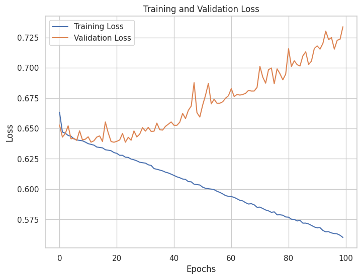

# Scenario 3

A hospital has a large dataset of patient records, including information on demographics, medical history, diagnoses, treatments, and outcomes. The hospital wants to use this data to develop a machine learning model that can predict the risk of readmission for patients
after they are discharged from the hospital. Develop a ML solution for the aforesaid prediction with an example Dataset.

# Solution

## Links

- The dataset has been taken from https://www.kaggle.com/datasets/dansbecker/hospital-readmissions/data
- The dataset is also locally available [here](./data/readmissions.csv)
- The Google Colab Notebook can be found [here](https://colab.research.google.com/drive/1xKcC7aTxdMSIRZde64EJ-vkR9HJXXmpA?usp=sharing)
- The ipynb file can be found [here](./Hospital_Readmission_Prediction.ipynb)
- The pdf for the same notebook can be found [here](./hospital-readmission-prediction.pdf)

## Dataset Description

We have a comprehensive hospital dataset which contains records of the patients' personal information, treatments, diagnoses, payment details, test results and readmission.
This is perfect for our use case.
  
## Dataset Exploration

The dataset mostly consists of dummy variables for various conditions. Additionally, it consists of *64 columns* excluding the readmitted criteria column.

We will visualize this by plotting the correlation matrix of the dataset

We can see that most of the columns are not highly correlated, so we will go forward with using all the columns for now

## Dataset Preparation

We will divide the dataset into the features and target.

After that we will visualize the features using PCA.

Our data is ready to be fed into the model

## Model Training

Our model consists of an input layer, 2 hidden layers and an output layer. It uses the *Adam Optimizer* and *Binary Cross Entropy loss*.

We directly feed the training features and targets into the model and train it.

## Model Evaluation

After the model is trained, it is evaluated on a separate testing dataset to assess its performance. This evaluation includes metrics such as accuracy, a classification report, and a confusion matrix. The classification report provides detailed information on precision, recall, and F1-score for each sentiment category, allowing us to understand the model's strengths and weaknesses.

For the training and evaluation visualizations, refer to the images below:

- Training and Val Loss Over Batches
    - 

- Accuracy, Classification Report and Confusion Matrix
    - 
    - 

These visualizations and evaluation metrics help us gauge how well the model can classify customer reviews into the appropriate sentiment categories.

### Important note about the model

We can see that our model is still not very accurate andn should not be put into production. This can be tackled through various methods which are mentioned in the below future scope.

## Future Scope

We can do the following :
1. We could explore the dataset to a greater extent to perform proper **Feature Engineering** to create a better dataset for training
2. We could train the model for a **greater number of epochs**