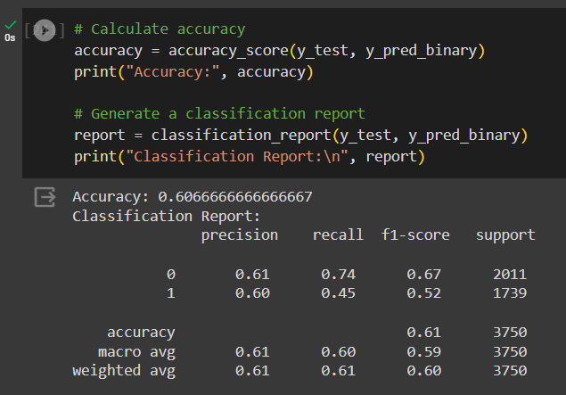

# Scenario 3

A hospital has a large dataset of patient records, including information on demographics, medical history, diagnoses, treatments, and outcomes. The hospital wants to use this data to develop a machine learning model that can predict the risk of readmission for patients
after they are discharged from the hospital. Develop a ML solution for the aforesaid prediction with an example Dataset.

## Links

- The Google Colab Notebook can be found [here](https://colab.research.google.com/drive/1F9qzOvG-hkCwBX519Sv8gbGN362BLjRi?usp=sharing)
- The ipynb file can be found [here](./Review_Sentiment_analysis.ipynb)
- The pdf for the same notebook can be found [here](./review-sentiment-analysis.pdf)

## Dataset Description

The dataset has been taken from https://www.kaggle.com/datasets/dansbecker/hospital-readmissions/data

For our sentiment analysis task, we will be using a larger example dataset that contains customer reviews and their associated ratings. The dataset includes a diverse set of customer reviews, covering both positive and negative sentiments, allowing us to train and evaluate our sentiment analysis model effectively. Each review is labeled with one of the following sentiments: 'very positive,' 'positive,' 'negative,' 'very negative,' or 'neutral.'

The dataset structure looks like this:
  
## Dataset Visualization

### Distribution of Sentiments

Visualizing the distribution of sentiments in the dataset is essential for understanding the balance of different sentiment categories. The bar chart below illustrates the distribution of sentiments in our dataset. This helps us ensure that our model will have sufficient data for each sentiment category to learn from.

### Word Clouds

Word clouds provide a visual representation of the most common words used in the reviews for positive and negative sentiments. These word clouds can give us insights into the language used by customers when expressing their opinions.

#### Word Cloud for Very Positive Sentiments

The word cloud for positive sentiments visually highlights the words and phrases that frequently appear in very positive reviews.

#### Word Cloud for Positive Sentiments

The word cloud for positive sentiments visually highlights the words and phrases that frequently appear in positive reviews.

#### Word Cloud for Negative Sentiments

The word cloud for negative sentiments shows the words and expressions commonly found in negative reviews, helping us identify patterns and key negative sentiments.

#### Word Cloud for Very Negative Sentiments

The word cloud for positive sentiments visually highlights the words and phrases that frequently appear in very negative reviews.

#### Word Cloud for Neutral Sentiments

The word cloud for positive sentiments visually highlights the words and phrases that frequently appear in neutral reviews.

## Model Training

Training a sentiment analysis model involves several crucial steps. It begins with tokenization, where text data is converted into numerical representations. The dataset is divided into batches to make the training process efficient, and optimization techniques are applied to minimize the loss function. During the training process, the loss is tracked to monitor how well the model is learning.

Please note that only a **small subset** of the data has currently been used due to computational restrictions. However, this can easily be changed by adjusting the values in the notebook.

Additionally, the model has been trained only for **3 Epochs** here due to time constraints. However, this could be increased to a much greater amount in a real world scenario.

## Model Evaluation

After the model is trained, it is evaluated on a separate testing dataset to assess its performance. This evaluation includes metrics such as accuracy and a classification report. The classification report provides detailed information on precision, recall, and F1-score for each sentiment category, allowing us to understand the model's strengths and weaknesses.

For the training and evaluation visualizations, refer to the placeholders below:

- Training Loss Over Batches
    - 

- Accuracy, Classification Report and Confusion Matrix
    - 
    - 

These visualizations and evaluation metrics help us gauge how well the model can classify customer reviews into the appropriate sentiment categories.

### Important note about model

Due to time constraints, the model has been trained on a *very small subset* of the dataset, and also has been trained for *very few epochs* due to which the model is not very good. This can easily be changed by tweaking the hyperparameters.

## Future Scope

We can do the following :
1. We could explore the dataset to a greater extent to perform proper Feature Engineering to create a better dataset for training
2. We could train the model for a greater number of epochs