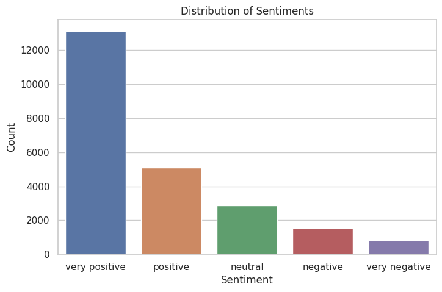
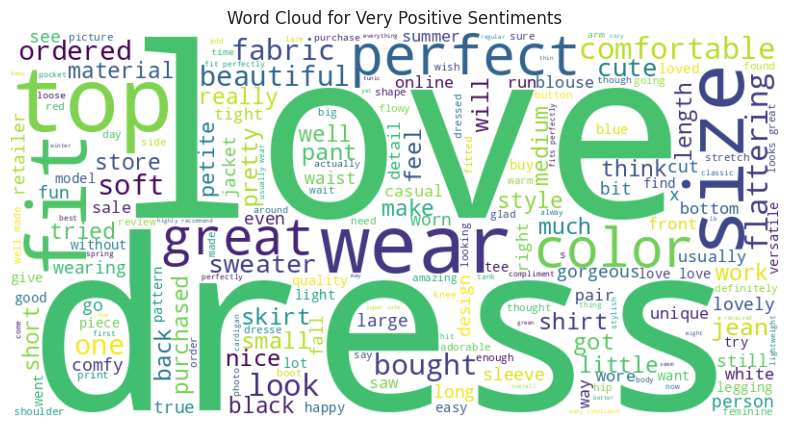
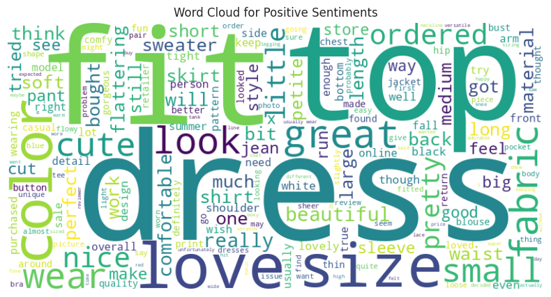
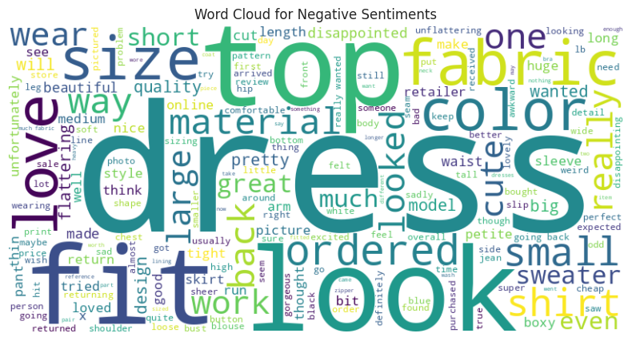
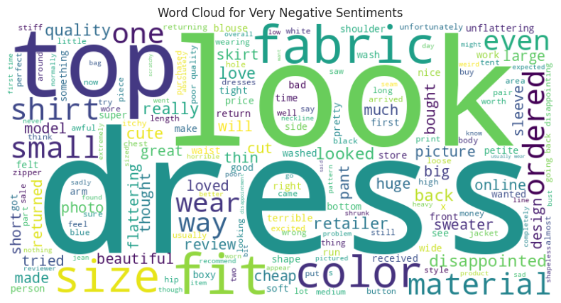
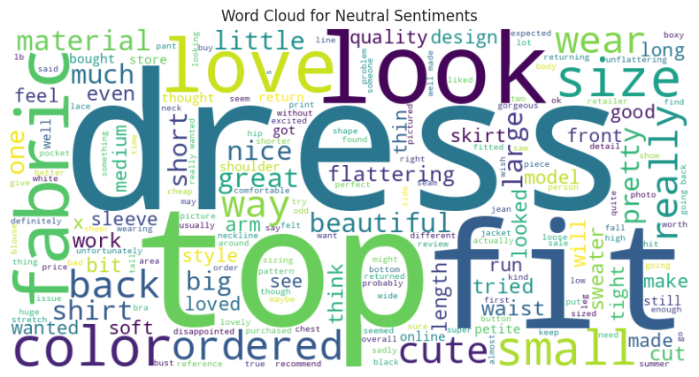
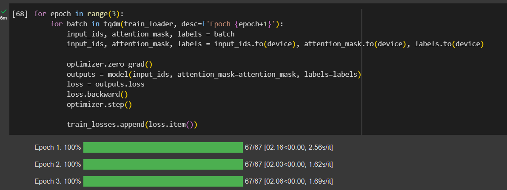
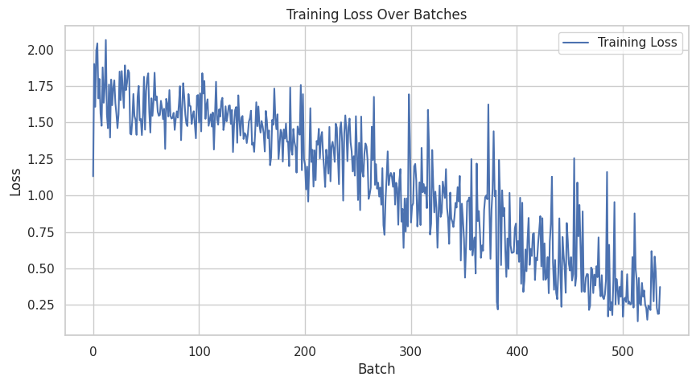
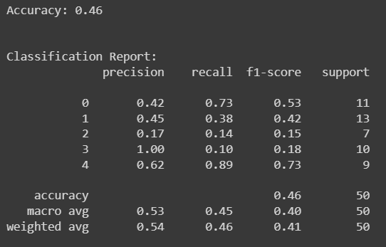
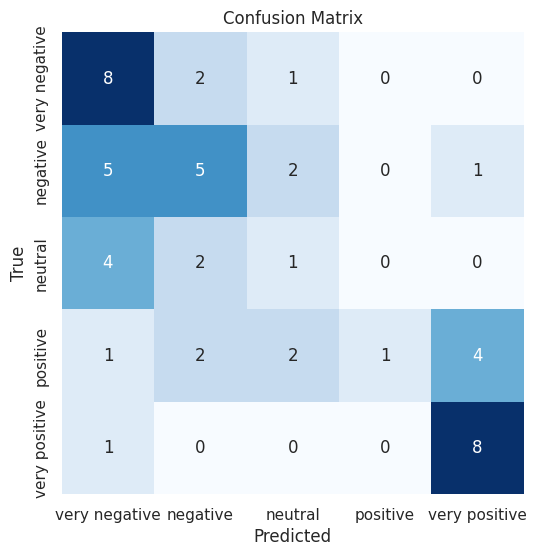

# Scenario 2

An online fashion retailer wants to develop a machine learning model that can classify customer reviews into different sentiment categories. The model will take as input a customer review and output a prediction of the review's sentiment, such as positive,
negative, or neutral. Develop a ML model for aforesaid classification with an example Dataset.

## Links

- The dataset has been taken from https://www.kaggle.com/datasets/nicapotato/womens-ecommerce-clothing-reviews/data
- The dataset is also locally available [here](./data/reviews.csv)
- The Google Colab Notebook can be found [here](https://colab.research.google.com/drive/1F9qzOvG-hkCwBX519Sv8gbGN362BLjRi?usp=sharing)
- The ipynb file can be found [here](./Review_Sentiment_Analysis.ipynb)
- The pdf for the same notebook can be found [here](./review-sentiment-analysis.pdf)

## Dataset Description

The dataset has been taken from https://www.kaggle.com/datasets/nicapotato/womens-ecommerce-clothing-reviews/data

For our sentiment analysis task, we will be using a larger example dataset that contains customer reviews and their associated ratings. The dataset includes a diverse set of customer reviews, covering both positive and negative sentiments, allowing us to train and evaluate our sentiment analysis model effectively. Each review is labeled with one of the following sentiments: 'very positive,' 'positive,' 'negative,' 'very negative,' or 'neutral.'
  
## Dataset Visualization

### Distribution of Sentiments

Visualizing the distribution of sentiments in the dataset is essential for understanding the balance of different sentiment categories. The bar chart below illustrates the distribution of sentiments in our dataset. This helps us ensure that our model will have sufficient data for each sentiment category to learn from.

### Word Clouds

Word clouds provide a visual representation of the most common words used in the reviews for positive and negative sentiments. These word clouds can give us insights into the language used by customers when expressing their opinions.

#### Word Cloud for Very Positive Sentiments

The word cloud for positive sentiments visually highlights the words and phrases that frequently appear in very positive reviews.

#### Word Cloud for Positive Sentiments

The word cloud for positive sentiments visually highlights the words and phrases that frequently appear in positive reviews.

#### Word Cloud for Negative Sentiments

The word cloud for negative sentiments shows the words and expressions commonly found in negative reviews, helping us identify patterns and key negative sentiments.

#### Word Cloud for Very Negative Sentiments

The word cloud for positive sentiments visually highlights the words and phrases that frequently appear in very negative reviews.

#### Word Cloud for Neutral Sentiments

The word cloud for positive sentiments visually highlights the words and phrases that frequently appear in neutral reviews.

## Model Training

Training a sentiment analysis model involves several crucial steps. It begins with tokenization, where text data is converted into numerical representations. The dataset is divided into batches to make the training process efficient, and optimization techniques are applied to minimize the loss function. During the training process, the loss is tracked to monitor how well the model is learning.

Please note that only a **small subset** of the data has currently been used due to computational restrictions. However, this can easily be changed by adjusting the values in the notebook.

Additionally, the model has been trained only for **3 Epochs** here due to time constraints. However, this could be increased to a much greater amount in a real world scenario.

## Model Evaluation

After the model is trained, it is evaluated on a separate testing dataset to assess its performance. This evaluation includes metrics such as accuracy, a classification report, and a confusion matrix. The classification report provides detailed information on precision, recall, and F1-score for each sentiment category, allowing us to understand the model's strengths and weaknesses.

For the training and evaluation visualizations, refer to the images below:

- Training Loss Over Batches
    - 

- Accuracy, Classification Report and Confusion Matrix
    - 
    - 

These visualizations and evaluation metrics help us gauge how well the model can classify customer reviews into the appropriate sentiment categories.

### Important note about model

Due to time constraints, the model has been trained on a *very small subset* of the dataset, and also has been trained for *very few epochs* due to which the model is not very good. This can easily be changed by tweaking the hyperparameters.

## Future Scope

We can do the following to scale up the model
1. We could **use the entire dataset** to get better results.
2. We could **increase max_length of the tokenizer** to get longer and more expressive encodings
3. We could train the model for a lot **more epochs**